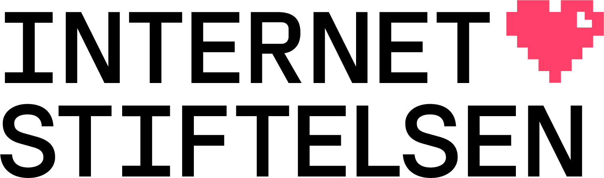

# IDN tables for .se and .nu TLDs

Normative sources for the IDN tables:

* [IDN table for .nu]
* [IDN table for .se]

LGR (XML) IDN tables derived from the normative 
sources:

* nu
  * Latin script: [nu_Latin_script.xml]
* se
  * Latin script: [se_Latin_script.xml]
  * Yiddish language: [se_Yiddish_language.xml]
  

#### Web: [https://www.internetstiftelsen.se/en/]

[https://www.internetstiftelsen.se/en/]:   https://www.internetstiftelsen.se/en/
[IDN table for .nu]:                       IDN_table_nu.pdf
[IDN table for .se]:                       IDN_table_se.pdf
[nu_Latin_script.xml]:                     nu_Latin_script.xml
[se_Latin_script.xml]:                     se_Latin_script.xml
[se_Yiddish_language.xml]:                 se_Yiddish_language.xml
